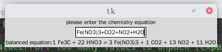

# A simple program to balance some chemistry equations
### environment: python3 with re, numpy, tkinter and fractions libs installed
#### caution: only based on conservation of mass, so not work for equations with less elements than components, and only work for equations with parentheses
## Usage:
**Linux Environment:**
__gui version__
```
./equation.py
```
or
```
python equation.py
```
enter the equation in the textbox:
### example


